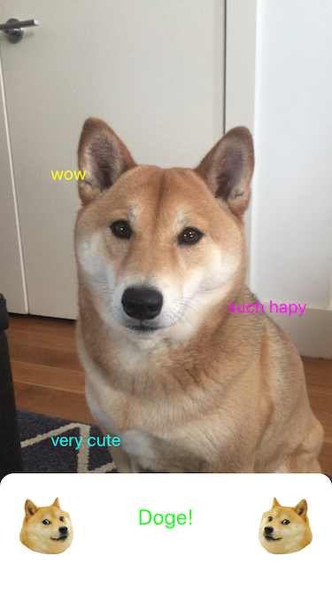

<h1>How to use notdoge</h1>

make sure to give notdoge camera access! it needs it to screen objects for your doge.

  <h3>such ML</h3>

  point your iPhone camera at a doge. doge should be recognized and text will appear. wow!
  
  

  <h2>very editable</h2>

  swipe up on bottom panel to edit memes
  
  
  
  touch text to change!
  
  
  

<h1>Privacy Policy</h1>

notdoge does not collect nor store user data. We do not have servers. We only wish to help you identify ur doge

notdoge was inspired by:
https://www.youtube.com/watch?v=ACmydtFDTGs
#and put kabosu homepage here
